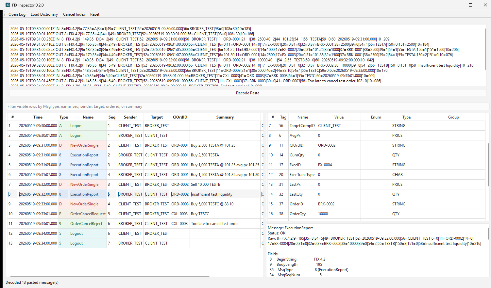

# FIX Inspector

[](https://github.com/khchanel/fixinspector/actions/workflows/ci.yml)

Offline FIX message viewer and decoder for troubleshooting trade logs.

## Requirements

- Python 3.12+
- `uv`
- `PySide6` (Qt6)
- Supported platforms: Windows, macOS, and Linux

## Run

```sh
uv run python main.py
```



## CLI

```sh
uv run python -m fixinspector.cli decode sample.log --format text
uv run python -m fixinspector.cli decode sample.log --format json
uv run python -m fixinspector.cli index sample.log
```

Custom QuickFIX-style XML dictionaries can be supplied with `--dict`.
